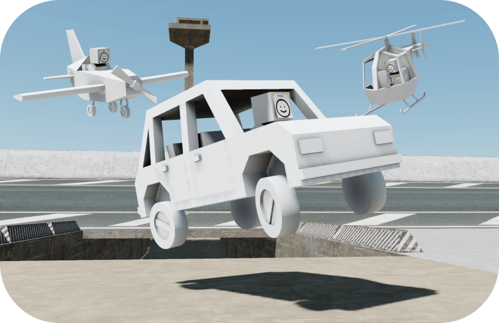

<p align="center">
	<a href="https://jblaha.art/sketchbook/latest"></a>
	<br>
	<a href="https://jblaha.art/sketchbook/latest">Live demo (original by swift502)</a>
	<br>
</p>

# 📒 Sketchbook

A maintained extension of the original [swift502/Sketchbook](https://github.com/swift502) — a small web-based game engine on [three.js](https://github.com/mrdoob/three.js) and [cannon-es](https://github.com/pmndrs/cannon-es) with a focus on third-person controls, vehicles and scripted scenarios.

This fork pulls in the features from later community forks that I felt were worth keeping, rebuilds the project on current tooling (TypeScript, three.js r183, webpack 5; dependency baseline as of **1 May 2026**) and exposes everything through one engine. See the [project timeline](#project-timeline) for who did what.

## Features

### World

- Day / night cycle with a sky shader, sun position controls, and a black space backdrop above the launch apex.
- Earth and Moon visible as celestial bodies; lunar gravity (~1.62 m/s²) kicks in on the moon.
- 2000-star night sky (camera-anchored shell, additive twinkle shader) — fades in as the sun drops, full brightness in space.
- Wave-based ocean with vertex displacement and a height query that boats actually ride.
- Procedural [300k-blade grass field](https://www.eddietree.com/grass) (instanced, 30-unit LOD) — wired to any map material called `grass`.
- 3D positional audio sources ("Speaker") with browser-autoplay handling.
- Procedural engine sound per vehicle (sawtooth + square exhaust + filtered noise intake; per-type profiles for car / heli / airplane / boat / rocket); RPM scales with chassis speed; routed through the same Master_Volume slider as positional audio.
- Procedural ambient soundscape (wind / bird-chirps via FM / water via LFO-swept bandpass), water gain gated by camera proximity to the ocean.
- Variable timescale, FXAA, cascaded shadow maps, adjustable gravity (0–2×).
- Camera shake on vehicle hard landings (sineNoise-based, three presets: collision / land / boost).
- All settings persist to `localStorage` with a one-click reset.
- Iris-wipe transition (CSS clip-path circle, 700ms) when switching maps, restarting a scenario, or reloading from the pause menu.
- Optional depth-Sobel outline overlay (toon look) — toggle in Settings.
- Optional Bloom (strength ramps at night) and Depth-of-Field (tighter focus while driving) — both off by default, toggles in Settings.

### Characters & NPCs

- Third-person camera, raycast capsule controller, full state machine (Sprint, Walk, Idle, Jump, Falling, Drop variants…).
- AI path-following — same convention used by both the AI vehicle drivers and standing/wandering NPCs.
- Name labels float above every character via a CSS2D pass; the player is tagged "Du" and stands out in blue.
- Two example NPCs walk a small loop at the default spawn, two more flank the player on idle.
- Wandering dogs & cats around the spawn area — dogs notice and bark, cats flee, both can be tamed.
- Distance-culled CSS2D world labels via a central registry — opt-in animal tags ("Hund" / "Katze") follow each animal and hide past 30 units.

### Vehicles

- Cars (with per-vehicle tuning sliders for friction, suspension, damping and engine force).
- Airplanes, helicopters.
- Boats with wave-riding physics and wave-aware AI path-following.
- Rocketship — 4-stage liftoff, smoke particle trail, planet-selection modal, automated Earth↔Moon transfer with soft auto-landing.
- Stuck / flip auto-recovery for player vehicles (lifts and yaw-resets after 6s of no movement under throttle, or 3s upside-down). Boats / Rocket opt out; air vehicles use flip-only.

### UI

- Title screen with bouncing-cube animation + language picker (gates audio autoplay).
- Loading screen with live percentage and progress bar driven by `LoadingManager`.
- Pause menu on Esc (timeScale=0, exits pointer lock) — Resume / Settings / Restart Scenario / Reload.
- Settings modal with Graphics / Audio / Controls cards — writes through lil-gui controllers so existing `onChange` handlers fire.
- Branching NPC dialog with typewriter reveal (28ms cadence) — click bar or press E / Enter / Space to skip, choices appear after typing finishes.
- Error overlay catches `window.onerror` + `unhandledrejection` into a frosted card with stack + Reload + Copy details.
- Centralised design tokens (`tokens.css`) with `class="dark"` dark mode toggle on `<html>`.

### Scenarios & Maps

- Free-roam (default and aviation), Oval / Tunnel / Figure-8 car races, Boat Race, stunt ramps.
- Curve-based race-checkpoint system with a HUD lap counter.
- Switchable maps from the **Scenarios** GUI panel (persists across reloads):
	- `Inthenew (v0.6, default)` — the bundled extended map
	- `sketchbook v0.3 (socketControl)` — original Sketchbook map with the grass material
	- `sketchbook v0.4 (socketControl)` — original Sketchbook map, full scenario set
	- Four code-built sandboxes from socketControl: `test`, `test2`, `test3`, `example` (TypeScript, editable directly)
- Compatibility with the [official three.js editor](https://threejs.org/editor/) — the sandbox project file is vendored under `ThreejsEditor/`.

### Authoring & extensibility

Map markers in `userData` light up code-side features automatically:

| Marker | Effect |
|---|---|
| `material.name === 'grass'` | Instanced grass field |
| `userData.data === 'speaker'` + `audio` | 3D positional audio source |
| `userData.type === 'cylinder'` | CANNON cylinder collider |
| `userData.type === 'shape'` + `subtype: box`/`sphere` | Dynamic physics primitive |
| `userData.type === 'npc'` / `character_ai` / `character_follow` | Standing or path-following NPC |

### Input

- Keyboard + mouse, free camera (`Shift+C`, `T` to teleport, `Z` to toggle the controls overlay).
- Joy-Con / gamepad via [benhatsor/joycon.js](https://github.com/benhatsor/joycon.js).
- On-screen touch controls (virtual joystick, jump / action / sprint buttons, drag-to-look) — auto-mounted on touch devices, dispatches synthesised keyboard + mouse events so the engine stays input-source-agnostic.
- i18n: English / Deutsch / Español with a language picker on the title screen; choice persists in `localStorage`. Pause menu, settings modal, error overlay and title-screen prompt are translated.

## Usage

Sketchbook needs to run on a local server (e.g. `npm run dev`) to load assets.

```html
<script src="sketchbook.min.js"></script>
<script>
	const world = new Sketchbook.World('scene.glb');
	// or pass a sandbox instance:
	// const world = new Sketchbook.World(new Sketchbook.Test3Scene());
</script>
```

## Running locally

1. Install a current LTS version of [Node.js](https://nodejs.org/en/).
2. `npm install`
3. `npm run build` — required before the first `npm run dev` because `build/sketchbook.min.js` is no longer committed.
4. `npm run dev` and open <http://localhost:8080>.
5. `npm run lint` to run ESLint over `src/ts/`.

---

# Project timeline

> **Attribution policy:** every port below tries to preserve the original commits or at least the original authors via `git format-patch` / `git am` or `git commit --author="…" --date="…"`. The intent is to honour each upstream author's work — and only their work — in `git log`.

## May 2026 — version 0.8.0 — New features ([manuelhintermayr](https://github.com/manuelhintermayr))

A round of new features added in this release. Each ships as its own commit linked below.

- **Design tokens** ([commit](https://github.com/manuelhintermayr/sketchbook-upgraded/commit/e0970713087556920b1ce28d259923068035cbfb)) — central `tokens.css` (~50 colour / typography / spacing / shadow / motion custom properties; `class="dark"` on `<html>` flips the surface palette to dark mode). All existing CSS modules refactored to reference the tokens — no more scattered magic numbers.
- **Title screen** ([commit](https://github.com/manuelhintermayr/sketchbook-upgraded/commit/e0970713087556920b1ce28d259923068035cbfb)) — bouncing cube + "press any key" gate that doubles as the audio-autoplay user gesture.
- **Loading screen** ([commit](https://github.com/manuelhintermayr/sketchbook-upgraded/commit/e0970713087556920b1ce28d259923068035cbfb)) — live percentage + bar driven by `LoadingManager`.
- **Pause menu** ([commit](https://github.com/manuelhintermayr/sketchbook-upgraded/commit/e0970713087556920b1ce28d259923068035cbfb)) — opens on Esc and actually pauses (timeScale=0, exits pointer lock, restores prior state on Resume) with Resume / Settings / Restart Scenario / Reload.
- **Settings modal** ([commit](https://github.com/manuelhintermayr/sketchbook-upgraded/commit/e0970713087556920b1ce28d259923068035cbfb)) — Graphics / Audio / Controls cards that write through lil-gui controllers so every existing `onChange` handler (CSM, pointer-lock, mouse sensitivity) keeps firing.
- **Branching NPC dialog** ([commit](https://github.com/manuelhintermayr/sketchbook-upgraded/commit/e0970713087556920b1ce28d259923068035cbfb)) — layered on top of `ProximityPrompt` (portrait, speaker line, numbered choices, mouse + 1–9 keys, auto-closes when the player walks away — Anna / Ben / Carla / Dieter all got hand-written 3-node trees explaining the world).
- **Error overlay** ([commit](https://github.com/manuelhintermayr/sketchbook-upgraded/commit/e0970713087556920b1ce28d259923068035cbfb)) — catches `window.onerror` + `unhandledrejection` into a frosted card with stack + Reload + Copy details.
- **Floating CSS2D name tags** ([commit](https://github.com/manuelhintermayr/sketchbook-upgraded/commit/e0970713087556920b1ce28d259923068035cbfb)) — player tagged "Du" in blue, NPCs in their own names.
- **Camera Shake** ([commit](https://github.com/manuelhintermayr/sketchbook-upgraded/commit/b9dd34c550f8da366970f9a0009558fa77af45f7)) — sineNoise-based per-frame camera offset triggered by vehicle hard landings; static fire-and-forget API, three presets (collision / land / boost), quadratic decay envelope, toggle in Settings.
- **Stuck / flip auto-recovery** ([commit](https://github.com/manuelhintermayr/sketchbook-upgraded/commit/cf9cb1060d441713e23e4e8630a817a46bf12c72)) — Vehicle base method that watches a per-frame distance-traveled window and an upside-down timer; lifts and yaw-resets when either threshold trips, fires a `collision` camera shake on recovery. Per-subclass opt-out (boats / rockets fully off, air vehicles flip-only).
- **Procedural engine sound** ([commit](https://github.com/manuelhintermayr/sketchbook-upgraded/commit/181e92140fa35381ea41f6ba234175943d8dbf6e)) — per-vehicle Web Audio synthesiser (2-layer exhaust + intake), RPM modulated by chassis speed, five timbre profiles (car / heli / airplane / boat / rocket). Master_Volume routes through the same slider that already drives THREE.AudioListener for positional audio.
- **Iris transition** ([commit](https://github.com/manuelhintermayr/sketchbook-upgraded/commit/4c887795129adefc4a9adb82577ef65bea37c0d9)) — singleton CSS clip-path overlay (700ms cubic-bezier circle wipe). Wired into the map switcher, scenario restart, and pause-menu reload — replaces the earlier white-flash `location.reload()` look with a clean black iris.
- **Outline effect** ([commit](https://github.com/manuelhintermayr/sketchbook-upgraded/commit/32449e442e2a3080c8fd540ca3a3b6b307017889)) — depth-Sobel pass: pre-renders the scene's linear depth to a float render target, then blends a Sobel kernel over the framebuffer via a fullscreen quad. Plays well with the existing FXAA composer, no shader rewrite needed; toggle in Settings.
- **Ambient soundscape** ([commit](https://github.com/manuelhintermayr/sketchbook-upgraded/commit/1573870e6fff3b17e4e5c04e38dc40eb876cd839)) — procedural wind / bird-chirp / water Web Audio synthesis with proximity-gated water gain (only audible near the ocean). Same Master_Volume bus as engine + positional audio.
- **Wandering animals** ([commit](https://github.com/manuelhintermayr/sketchbook-upgraded/commit/4c5a13e8c121fa5c4d1663de764b4526f375e1e5)) — 8 dogs + 10 cats spawned deterministically around the Inthenew spawn, each running a small state machine (idle / wander / approach / bark / flee / tame). Geometry merges primitive shapes — no GLTF asset; ground height is queried per-frame via cannon raycast so the animals adapt to any map.
- **Star field at night** ([commit](https://github.com/manuelhintermayr/sketchbook-upgraded/commit/5037501e5807a68853d608bf735ad90802bd4f33)) — 2000 points on the upper hemisphere of a camera-anchored shell with a twinkle shader. nightFactor is derived from sun position, so they fade in at dusk and stay full in space.
- **Touch controls** ([commit](https://github.com/manuelhintermayr/sketchbook-upgraded/commit/3dd1be5548ec0cc77cafd45141b0bb04498d2bba)) — virtual joystick + jump / action / sprint buttons + drag-to-look camera area, auto-mounted on touch devices. Synthesises KeyboardEvent / MouseEvent pairs so InputManager handles them as if from a hardware keyboard / mouse.
- **i18n + language picker** ([commit](https://github.com/manuelhintermayr/sketchbook-upgraded/commit/dbbe34030fe6384fd22953899fecb31d730fef3f)) — flat translation table (en / de / es), `t(key, vars)` lookup, persisted to `localStorage`. Title screen shows a language picker at the bottom; pause menu, settings modal, and error overlay are translated.
- **Bloom + Depth-of-Field** ([commit](https://github.com/manuelhintermayr/sketchbook-upgraded/commit/34920c47808b0b1d560fc9893e2b79222311d688)) — three's `UnrealBloomPass` + `BokehPass` added to the existing composer pipeline; bloom strength ramps at night, DoF focus tightens while driving. Toggles per pass — no new dependency.
- **Centralised world labels** ([commit](https://github.com/manuelhintermayr/sketchbook-upgraded/commit/cc03c9d3333de6dc261c3b453d1537bf7195b539)) — `WorldLabels` registry on top of the existing CSS2DRenderer that adds distance culling and feature-flag gating. `attachNameLabel` keeps its old signature (back-compat) and gains options for `maxDistance`/`feature`. Wandering animals use it for opt-in "Hund" / "Katze" tags.
- **Dialog typewriter** ([commit](https://github.com/manuelhintermayr/sketchbook-upgraded/commit/08f05dc281dfe962df47acc0faa353e327fcfe6c)) — NPC dialog text reveals one character at a time (28ms cadence). Choices stay hidden until the line finishes. Click the bar or press E / Enter / Space to skip.

A follow-up performance & internals pass (no user-visible behaviour changes):

- **Audio base class extraction** ([commit](https://github.com/manuelhintermayr/sketchbook-upgraded/commit/53bd1ac34d1fa8042c2a222c998bd7a55554d5e5)) — pull the shared Web Audio plumbing (shared `THREE.AudioListener` context, master gain, lifecycle) out of `EngineSound` / `AmbientSound` into a `ProceduralAudio` base. All four audio modules moved under `world/audio/`. Stops every audio source from spinning up its own `AudioContext` (browsers cap around 6 per tab).
- **Animal raycast throttle** ([commit](https://github.com/manuelhintermayr/sketchbook-upgraded/commit/60daa7d24bde7dab4e6d274848e409096c0d4b8a)) — ground-height ray for each wandering animal now fires every 100 ms instead of every frame, with a per-animal stagger so they don't all sample the same tick. Y-position lerps between samples so motion stays smooth. Cuts ~1080 raycasts/sec on the default spawn down to ~180.
- **Animal frustum culling + Dog/Cat strategy split** ([commit](https://github.com/manuelhintermayr/sketchbook-upgraded/commit/b9e1f60d0cf327138c1716bbb2ed3f8995088473)) — per-animal AABB check skips updates for off-screen instances; the per-species AI lives in `DogBehavior` / `CatBehavior` strategy classes, while the shared idle/wander/tame logic stays in an `AnimalBehavior` base. Each behaviour is exported as a singleton — stateless, one instance shared across every animal.
- **Pool Vector3 / Quaternion scratches in physics paths** ([commit](https://github.com/manuelhintermayr/sketchbook-upgraded/commit/3c03ef3ce2dc5af26779994ad155535991295583)) — `physicsPreStep` / `physicsPostStep` / wheel-update / springRotation across Helicopter, Airplane, Car, Vehicle and Character ran at 60 Hz per instance and allocated ~3500 throwaway objects per second. Move them to module-scoped scratches that get `.set()` / `.copy()` into each call. Pure GC pressure relief.
- **Clamp renderer pixelRatio** ([commit](https://github.com/manuelhintermayr/sketchbook-upgraded/commit/0b4734efed746ae72507d97e5678b7662f43a1cd)) — cap `setPixelRatio` at 2. Phones and tablets often report DPR 3–4 which forces the GPU to render 9–16× the pixels per frame for sharpness gains the eye barely registers past 2×. Desktop displays unaffected.
- **Halve CSM shadow map size** ([commit](https://github.com/manuelhintermayr/sketchbook-upgraded/commit/efb5dd48d8bbc819e3442b788a96168bb506d09b)) — `shadowMapSize` 2048 → 1024 across the 3 cascades. Drops shadow-pass work from ~12.6 MP/frame to ~3.15 MP and saves ~37 MB VRAM, with barely visible quality loss on an organic sandbox scene.
- **Semantic UpdateOrder enum** ([commit](https://github.com/manuelhintermayr/sketchbook-upgraded/commit/01ebcb68c8a7b7e0257b873692c0df42b00d847c)) — replace 17 hand-picked `updateOrder` magic numbers (`1`, `2`, `3`, `4`, `5`, `6`, `10`, `11`, `12`, `13`, `14`, `15`) with named slots (`CharacterPhysics → VehiclePhysics → Input → Camera → Environment → Scenarios → World → Audio → Triggers → Prompts → Labels → PostCamera`), spaced by 10 so a new slot can squeeze between two existing ones without renumbering. Relative order preserved 1:1 — pure naming/documentation. Also fixes two stale comments that cited the old wrong values.
- **Common controls helper** — extract the duplicated on-screen-help rows shared across Character + 5 vehicles (V / F / Shift+R / Shift+C) into `commonGlobalControls()` + `commonVehicleControls()` in `core/CommonControls.ts`. Cuts 18 duplicated bullet rows down to 5 central definitions; future tweaks to a global shortcut now touch one file instead of six.
- **HUD controls list fixes** — two related bugs in the on-screen controls overlay. (1) X (Switch seats) now shows in the driving HUD whenever the vehicle's GLB authored connectedSeats (Car / Helicopter), so the actually-functional X press is finally documented for the player. (2) At scenario start the HUD no longer freezes on the AI-driver vehicle's controls list: an AI being teleported into a vehicle by `VehicleSpawnPoint` skipped through `Character.startControllingVehicle` and ran the vehicle's `inputReceiverInit`, which overwrote the player's WASD list before the player had even moved. Now that path runs only when the calling character is the active input receiver.
- **GPU shader pre-compile** — `LoadingManager.doneLoading` now awaits `renderer.compileAsync(scene, camera)` before lifting the loading screen. Three.js otherwise compiles each unique material+light permutation lazily on first sight, which causes a 20–200 ms frame stall the first time the player turns toward an as-yet-unrendered car / NPC / ocean tile. compileAsync walks the scene up front and yields between programs so the loading screen stays responsive.
- **Outline pass — layer skip + distance-aware threshold** — the depth pre-pass that drives the toon outline shader used to render the entire scene under an override material, including 300k grass-blade instances, 2000 star points, the sky shell, both celestial bodies, and the wave tiles. New `RenderLayer.OutlineSkip` layer (in `enums/RenderLayers.ts`); Sky/Stars/Earth/Moon/Grass/Ocean opt onto it; `OutlineEffect.renderPass` strips that bit on the camera before the depth pre-pass and re-enables it after. Sobel shader gains a `depthFalloff` term so distant pixels need a bigger depth gap to register as an edge, killing the flicker that linear-depth precision used to produce on far terrain. Net: depth pre-pass goes from "everything in the scene" to "Character + Vehicles + NPCs + buildings only", and the resulting outlines are stable instead of buzzing on far objects.
- **Outline depth RT: HalfFloat instead of Float** — the depth pre-pass writes a normalised value in [0..1] that the Sobel kernel only ever compares against a 0.003 threshold, so 32-bit float per channel was overkill. Switching the render-target to `HalfFloatType` halves its VRAM and write/read bandwidth (~16 MB → 8 MB at 1080p, more on Retina) with no visible quality change.
- **Hoist defaultDialogs out of NPC spawn loop** — `getDefaultDialogs()` builds the full Anna/Ben/Carla/Dieter dialog tree (≈ 36 i18n lookups + four nested object literals). It was being called *inside* the NPC spawn loop in `injectDefaultSceneNPCs`, so each scenario launch reconstructed the entire tree once per NPC (4×). Hoist the call ahead of the loop — single build per launch, no behavioural change. Locale switch + scenario restart still picks up the new translation because the function still runs once per launch.
- **SettingsModal lil-gui controller cache** — `SettingsModal.findController` walked `gui.controllersRecursive()` and linear-searched the result on every settings change. With ~40 controllers across the lil-gui folder tree, that's a fresh tree-walk and ~40 string compares for *every* `input` event a slider drag fires (30–50 per drag). Build the index once on the first lookup and cache it as a `Map<string, controller>` — drag now resolves through O(1) `Map.get`. Lazy-built so the cache catches the gui after World finishes wiring it up.
- **SettingsModal: quality presets** — graphics card now opens with a Low / High preset row that flips Shadows + Outlines + Bloom + Depth of Field together. The individual toggles still work for fine-tuning; the presets are shortcuts for the four settings that matter most for FPS on integrated GPUs and mobile. Three new i18n keys (`settings.presets`, `settings.presetLow`, `settings.presetHigh`) cover en/de/es; preset writes route through the existing `write()` path so the lil-gui controllers' onChange handlers (CSM enable/disable, etc.) still fire.
- **defaultDialogs: locale-keyed cache** — `getDefaultDialogs()` is called once per scenario launch (after the earlier hoist out of the NPC spawn loop), but the same tree was rebuilt from scratch on every Shift+R / map-switch even when the player hadn't touched the language. Add a module-level cache keyed on the current locale so a stable language reuses the previous tree; the moment the title-screen language picker fires it invalidates and the next launch rebuilds in the new locale.
- **MapSwitcher: drop redundant validValues array** — `addMapSwitcher` was building a fresh `string[]` of all valid map ids just to call `.indexOf(stored)` on it once. Replace with a direct `for ... in` lookup against the existing `choices` map — same logic, no intermediate allocation. Object.values would be even cleaner but we target ES2015.
- **Auto-recovery threshold widened: 100° → 80°** — `UPSIDE_DOWN_THRESHOLD` was inherited from Inthenew at `cos(100°)`, which means a vehicle had to be tilted past 100° from vertical (i.e. genuinely upside-down) before flip-recovery would even start counting. A heli or car that landed cleanly on its side at 90° was below the threshold and just stayed there. Drop to `cos(80°)` so anything past horizontal counts; a 45° hill still reads upY ≈ 0.7 so non-flipped parked vehicles aren't caught.
- **Vehicle.ts: extract StuckRecovery helper** — the stuck/flip auto-recovery logic (sample window, flip timer, cooldown, lift+yaw-only reset) was ~110 LOC inline on the Vehicle base — three concerns mixed into one class. Pull it into `vehicles/StuckRecovery.ts` as a self-contained helper that takes a `(body, noDirectionPressed)` pair in its constructor. Vehicle holds an instance, calls `update(timeStep)` while a driver is in the seat and `reset()` otherwise. Subclasses that opt out (Helicopter / Airplane stuck-only, Boat / Rocket both gates) flip the public flags on the helper instead of on Vehicle itself. Vehicle.ts: 685 → ~575 LOC, behaviour preserved 1:1.
- **Speaker pendingResume queue cleanup** — `Speaker.pendingResume` is a static array that parks audio elements waiting for the first user gesture (browser autoplay policy). Once a click or keypress lands the queue plays everything and clears. If a scenario switch (Shift+R, map change) happens *before* that first gesture though, the Speaker's `removeFromWorld` only paused and detached the dom element — the static array still held a reference, blocking GC, and the eventual gesture would call `.play()` on a removed dom node. `removeFromWorld` now splices the element out of the queue so the static state stays in sync with what's actually live.
- **RocketShip flight-timer cleanup on world removal** — `RocketShip` keeps five `setInterval` handles for the liftoff staging, the cruise velocity push, and the descent velocity push. A scenario switch (Shift+R, map change) mid-flight removed the rocket from the world but left the timers ticking — they kept writing into a detached cannon body's `velocity` / `position` until eventually a stale `clear` from the next scenario landed. Override `removeFromWorld` to call the existing `stopLiftoff` / `cancelTravelTimers` / `cancelDropTimers` and hide the planet menu so dangling listeners can't fire either.
- **Outline pass: scale-invariant threshold + skinned-mesh fix** — two related issues with the toon outline pass that surfaced together. (1) The custom DEPTH_VERTEX shader sampled `position` directly, so SkinnedMesh characters and animated NPCs rendered into the depth RT in *bind pose* — the Sobel kernel then drew the outline of the rest-position skeleton offset from the actually-animated body on screen. Switch the override to `THREE.MeshDepthMaterial`, which wires the skinning + morph-target chunks via three's standard pipeline. (2) The depth threshold was absolute (`0.003`) which only catches one distance regime — close-up players (third-person camera radius is 1.6, depth ≈ 3e-5) had numeric edge gradients far below threshold and never outlined, while distant NPCs did. Replace with a ratio-based test (`edge / max(avgDepth, 1e-6)` against a tunable `relativeThreshold`); a clean object-vs-background silhouette gives ratio ≈ 8 at every distance, smooth interior surfaces stay near 0. Drops the now-unused `cameraNear`/`cameraFar` uniform plumbing along with the per-frame uniform writes.

## March 2026 — version 0.7.5 — Notblox features port ([iErcann](https://github.com/iErcann)) ([commit](https://github.com/manuelhintermayr/sketchbook-upgraded/commit/31c51c472c3c908cdb2c28b75e973aa7ec565c9f))

Brings the **TriggerCube + ProximityPrompt** entity pair from [iErcann/Notblox](https://github.com/iErcann/Notblox) — the multiplayer / ECS layer is dropped, the entities themselves are reshaped into single-player Sketchbook-style classes. They underpin the in-game NPC interaction prompts and any future "step into a zone to do X" mechanic.

## November 2025 — version 0.7.0 — socketControl features port ([tkkaushik369](https://github.com/tkkaushik369)) ([commit](https://github.com/manuelhintermayr/sketchbook-upgraded/commit/1c8619d546617a3b4a963fa83fb58bde2a7fffa9))

Mines features from [tkkaushik369/socketControl](https://github.com/tkkaushik369/socketControl) (MIT), skipping its multiplayer / ECS layer entirely. Each feature ships as its own commit attributed to tkkaushik369 where identifiable.

What landed: curve-based race tracking with checkpoint planes; instanced grass field with LOD; 3D positional audio Speaker; CylinderCollider + SphereCollider; ShapeSpawnPoint for dynamic box/sphere primitives; NPC system (standing or path-following) with floating name tags via a CSS2D pass; sketchbook v0.3 + v0.4 maps from socketControl plus four code-built sandbox scenes (`test`, `test2`, `test3`, `example`); Scenarios-panel map switcher; THREE.js Editor compatibility (`ThreejsEditor/project.json`).

Skipped: water (Inthenew's wave ocean is better), extended character states (already in upstream), all multiplayer / ECS / networking plumbing.

## August 2025 — version 0.6.0 — day/night cycle, boats & rocketship ([inthenew](https://github.com/Inthenew)) ([commit](https://github.com/manuelhintermayr/sketchbook-upgraded/commit/e939ca075ef2468e419b67921ab6d8b26e216fb5))

Pulls in [Inthenew/Sketchbook](https://github.com/Inthenew/Sketchbook): day/night cycle, wave-based ocean replacing the original flat water, boats with wave-aware physics + Boat Race scenario, lap tracking on the three car races, the full Rocketship feature (chassis, smoke particles, planet-select modal, Earth↔Moon flight + auto-landing), Earth + Moon as celestial bodies, lunar gravity, Vehicles GUI tuning sliders, Free-camera quality-of-life (`T` teleport, `Z` overlay toggle, return-to-forward slerp).

Inthenew squashes upstream commits, so each feature was re-ported individually with `--author="inthenew <matthew@slocum.io>"` and the original date. The level (`build/assets/world.glb`) was replaced with Inthenew's so all the hand-tuned coordinates (no-wave dock zone, race paths, rocket island) stay in sync.

**Asset re-creation:** Inthenew's upstream hotlinked six third-party images that couldn't legally be vendored (DeviantArt fan-art, an anonymous Imgur upload, Farmers Almanac and Adobe Stock photos, a Future plc CDN asset, and a Wikimedia photo with attribution requirements). All were dropped and replaced with DALL-E generated equivalents shipped under `src/img/` — same intent and visual style, no licence baggage.

## September 2024 — version 0.5.1 — [cjmott](https://github.com/cjmott) ([commit](https://github.com/cjmott/Sketchbook/commit/088fffc743818d13babeecd87c8ba3165cf13fcb))

> I plan to use Sketchbook as a basis to develop another project, so I have updated the code to run on the latest version of all the packages and switched from cannon.js, which is no longer maintained, to cannon-es.js. […] The biggest change has involved updating to the new version of THREE.js, which no longer supports the object types `Geometry` and `Face3`, replacing both with `BufferGeometry`. Note that I have also updated the sky shaders to use an example provided on the THREE.js website.

### April 2026 follow-up — version 0.4.1.2 — toolchain re-modernisation ([manuelhintermayr](https://github.com/manuelhintermayr)) ([commit](https://github.com/manuelhintermayr/sketchbook-upgraded/commit/1a99803b366f49385dfac80c76ab86371f154915))

A second pass on top of cjmott's work: dependencies updated to current versions (TypeScript 6, ESLint, three.js r183, webpack 5), legacy in-repo utility copies replaced with maintained npm packages (lil-gui, stats.js, cannon-es-debugger), unused legacy files dropped. Behaviour and architecture preserved — gameplay changes start in May.

## February 2024 — version 0.5.0 — Joy-Con port ([barhatsor](https://github.com/barhatsor)) ([commit](https://github.com/manuelhintermayr/sketchbook-upgraded/commit/1db12aa2ef697886b049386ef28a55e12f08acdd))

Adds Joy-Con / gamepad support originally written by [Bar Hatsor](https://github.com/barhatsor) in [benhatsor/Joycon-Sketchbook](https://github.com/benhatsor/Joycon-Sketchbook). Original commits preserved via `format-patch` / `am`. The controller layer only synthesises keyboard/mouse events, so the engine itself is untouched. The unpinned `cdn.cde.run/Joycon.min.js` was vendored under `vendor/joycon/`.

## February 2023 — version 0.4.0 — [swift502](https://github.com/swift502) ([commit](https://github.com/swift502/Sketchbook-upgraded/commit/62f4b7986fd1ce1e4f91daba89ef032c20a6ce55)), final update from the original author

> As I have no more interest in developing this project, it comes to a conclusion. […] If you wish to modify Sketchbook feel free to fork it. The [NPM package](https://www.npmjs.com/package/sketchbook) name is available, and I'll give it away to anyone who asks for it. The package has never worked properly.

---

## TODO

- Bring over remaining features from [iErcann/Notblox](https://github.com/iErcann/Notblox) (excluding multiplayer), with priority on moving from cannon to rapier.
	- Evaluate controller integration from [pmndrs/ecctrl](https://github.com/pmndrs/ecctrl) or [pmndrs/BVHEcctrl](https://github.com/pmndrs/BVHEcctrl).

---

## Credits

- [swift502](https://github.com/swift502) — original Sketchbook engine.
- [cjmott](https://github.com/cjmott) — September 2024 toolchain revival (cannon-es, modern three.js).
- [Inthenew](https://github.com/Inthenew) — boats, wave ocean, races, day/night cycle, rocketship + moon, lunar gravity (v0.6.0 feature set).
- [Bar Hatsor (barhatsor)](https://github.com/barhatsor) — Joy-Con / gamepad integration.
- [tkkaushik369](https://github.com/tkkaushik369) — socketControl: race-checkpoint system, instanced grass field, Speaker, CylinderCollider, ShapeSpawnPoint, the four sandbox scenes, and the THREE.js editor workflow.
- [iErcann](https://github.com/iErcann) — Notblox: TriggerCube + ProximityPrompt design.
